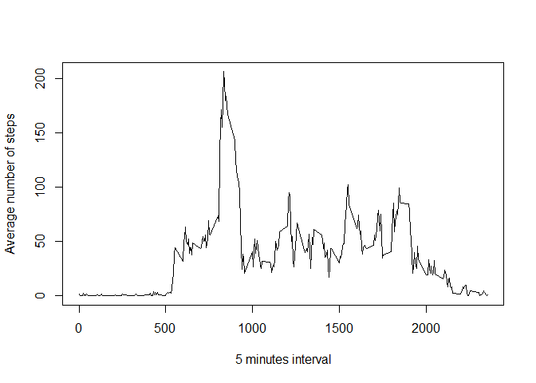

## Loading and preprocessing the data


```r
unzip(zipfile="activity.zip")
myData <- read.csv("activity.csv")
```

## What is mean total number of steps taken per day?

This section presents the histogram, the mean and the median of the total number of steps taken each day.


```r
totalStepsPerDay <- tapply(myData$steps, myData$date, FUN=sum, na.rm=TRUE)

hist(totalStepsPerDay, breaks = 20, 
     xlab="Total number of daily steps", 
     main = "Histogram of Total number of daily steps")
```

<!-- -->

```r
mean(totalStepsPerDay, na.rm=TRUE)
```

```
## [1] 9354.23
```

```r
median(totalStepsPerDay, na.rm=TRUE)
```

```
## [1] 10395
```

## What is the average daily activity pattern?

Time series plot of the average number of steps taken


```r
averageSteps <- aggregate(x = list(steps = myData$steps), 
                          by = list(interval = myData$interval), 
                          FUN=mean, na.rm=TRUE)

plot(steps ~ interval, data = averageSteps, type = "l", xlab = "5 minutes interval", ylab = "Average number of steps")
```

<!-- -->

Looking to identify the 5-minute interval that, on average, contains the maximum number of steps.


```r
averageSteps[which.max(averageSteps$steps),]
```

```
##     interval    steps
## 104      835 206.1698
```

## Imputing missing values

Code to describe and show a strategy for imputing missing data


```r
### Identify intervals having missing values. Missing values are coded as `NA`.
missingData <- is.na(myData$steps)

### Display summary
summary(missingData)
```

```
##    Mode   FALSE    TRUE 
## logical   15264    2304
```

```r
### Replace each missing value with the mean value of its 5-minute interval

### create function filler that keeps good values as they are and replace missing ones with the mean value of its 5-minute interval
filler <- function(steps, interval) 
        {
                filled <- NA
                if (!is.na(steps))
                        filled <- c(steps)
                else
                        filled <- (averageSteps[averageSteps$interval==interval, "steps"])
                return(filled)
}

### Apply filler function on a copy of myData dataset 
newData <- myData
newData$steps <- mapply(filler, newData$steps, newData$interval)
```

Histogram of the total number of steps taken each day after missing values are imputed.


```r
newTotalStepsPerDay <- tapply(newData$steps, newData$date, FUN=sum, na.rm=TRUE)
hist(newTotalStepsPerDay, 
     breaks = 20, 
     xlab="Total number of daily steps", 
     main = "Histogram of Total number of daily steps")
```

<!-- -->

```r
mean(newTotalStepsPerDay, na.rm=TRUE)
```

```
## [1] 10766.19
```

```r
median(newTotalStepsPerDay, na.rm=TRUE)
```

```
## [1] 10766.19
```

## Are there differences in activity patterns between weekdays and weekends?


First, let's find the day of the week for each measurement in the dataset. In
this part, we use the dataset with the filled-in values.


```r
### create function for weekend identification
isWeekend <- function(date) 
        {
                dayOfWeek <- weekdays(date)
                if (dayOfWeek %in% c("Monday", "Tuesday", "Wednesday", "Thursday", "Friday"))
                        return("weekday")
                else if (dayOfWeek %in% c("Saturday", "Sunday"))
                        return("weekend")
                else
                        stop("Wrong data")
        }
### Apply isWeekend function on newData by adding a new column for daytype
newData$date <- as.Date(newData$date)
newData$daytype <- sapply(newData$date, FUN = isWeekend)

newData$daytype = factor(newData$daytype, levels = c("weekday", "weekend"))
```


Panel plot comparing the average number of steps taken per 5-minute interval across weekdays and weekends


```r
newAverageSteps = aggregate(steps ~ interval + daytype, newData, mean)

xyplot(steps ~ interval | factor(daytype), 
       data = newAverageSteps, aspect = 1/2, type = "l", 
       xlab = "5 minutes interval", 
       ylab = "Number of steps")
```

<!-- -->

